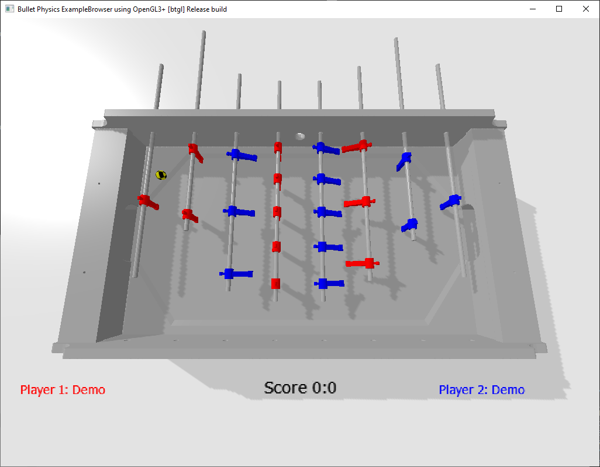

Simulator za projekt FuzbAI

# Uvod
Paket je namenjen testiranju algoritmov za agente (igralce) namiznega nogometa v simuliranem okolju.

# Sestavni deli
Paket FuzbAISim je sestavljen iz simulatorja, REST serverja ter agentov.

## Simulator FuzbAISim
Simulator FuzbAISim se požene kot Windows .exe aplikacija (FuzbAISimWrapper.exe). Izvajati se mora na istem sistemu kot REST server.



### Upravljanje s simulatorjem
S simulatorjem se upravlja preko tipkovnice in miške.

Ob zagonu simulatorja sta aktivna demo igralca za rdeče in modre igralce. Za preklop na podatke iz REST API serverja, uporabi tipki '1' ali '2' (preklop prikaza iz 'Demo' v 'External').

Bližnjice na tipkah:
- **1**: Vklop/izklop vgrajenega demo igralca za rdeče igralce
- **2**: Vklop/izklop vgrajenega demo igralca za modre igralce
- **Esc**: Zaustavitev simulatorja
- **Enter**: Ponoven met igralne žogice

Igralno žogico se lahko po potrebi premika tudi z miško ('drag&drop').


## Server HTTP REST API za FuzbAISim
Repozitorij vsebuje tudi HTTP REST API server za FuzbAI v obliki Python datoteke. Za zagon je potrebno namestiti pakete `fastapi`, `uvicorn`

Server se požene iz terminala kot
```py .\FuzbAISimServer.py```

Za dokumentacijo REST API vmesnika, odpri vgrajeno spletno stran [`http://127.0.0.1:23336/docs`](http://127.0.0.1:23336/docs)

## Primer agenta (igralca) FuzbAI
Primer delujočega agenta za FuzbAI je v datoteki `FuzbAIAgent_Example.py`. Privzeto se agent uporabi za rdeče igralce, za modre igralce je potrebno spremeniti URL naslov v vrstici 15 - `blue` je potrebno postaviti na `True`.

Primer prikazuje sinusno premikanje palice 0 (golman) ter brco vsakih 5 sekund. Primer se ne odziva na položaj žoge ali ostalih igralcev, prav tako ne premika ostalih palic. Za premikanje vseh 4 palic igralca je potrebno v polje
`commands` dodati ukaze za vse 4 palice (t.j. vsaka palica ima svoj zapis v tem polju, kjer `driveID` nakazuje za katero palico dejansko gre - vrednosti 1, 2, 3 ali 4).
